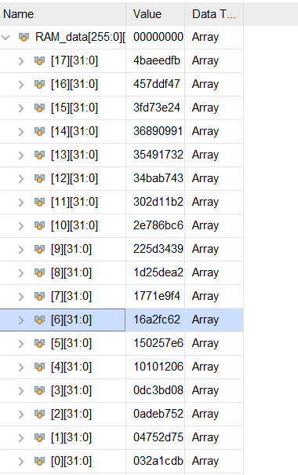

## 流水线MIPS处理器实验报告

### 项目设计

​	本项目完成了一个主频为102.6MHz的流水线结构的MIPS处理器，并利用此处理器和所编写的冒泡排序算法，将128个32bit的无符号随机数进行排序，并利用BCD7显示排序算法所需的时钟周期数。下面将详细介绍项目原理。

### 项目原理

#### 流水线结构

本项目采用MIPS五级流水线结构，使用4个寄存器存放相关数据和信号。下面是各级流水线的功能简述。

#### **IF**级

IF级的主要功能包括PC的更新、读取Instruction Memory获取指令、将之后所需数据写入IF/ID流水线寄存器等。

#### ID级

​       ID级的主要功能包括控制信号、部分转发信号的生成、寄存器堆的读取、立即数的扩展、将之后所需数据写入ID/EX流水线寄存器等。

#### EX级

​    EX级的主要功能包括ALU的运算、分支控制信号的生成、部分转发信号的生成、将之后所需数据写入EX/MEM流水线寄存器等。

#### MEM级

​    MEM级的主要功能包括对Data Memory中的数据进行读写操作、对外设进行控制操作、将之后所需数据写入MEM/WB流水线寄存器等。

#### WB级

​       WB级的主要功能包括写入寄存器堆、冒险检测等。

#### 转发单元

   本项目在ID级和EX级分别实现了转发单元。值得一提的是，在理论课程中我们只针对EX级的转发重点进行了讲解，但是在编写CPU的过程中我发现，如果使用之前单周期大作业中的Register File，则会出现“先写后读”的情况，这与理论课中所讲的寄存器堆先读后写有所区别，因此需要在ID阶段增加额外的转发单元；此外，由于`jr`、`jalr`指令在ID阶段需要用到`Rs`寄存器，因此也要在该阶段增加转发。因此，ID阶段的转发主要完成的是上述两个功能。而EX阶段的转发便与理论课中所讲相同，即需要得到来自EX/MEM、MEM/WB寄存器的转发。

​    两个转发单元相关代码如下：

```verilog
module IDforward(
        IF_ID_Rs, ID_EX_Rd, EX_MEM_Rd, EX_MEM_RegWrite, ID_EX_RegWrite, forward
    );
    input [4:0] IF_ID_Rs;
    input [4:0] ID_EX_Rd;
    input [4:0] EX_MEM_Rd;
    input EX_MEM_RegWrite;
    input ID_EX_RegWrite;
    output [1:0] forward;
    
    assign forward = ID_EX_RegWrite && (ID_EX_Rd !=5'b00000) && (IF_ID_Rs == ID_EX_Rd)? 2'b11:
                      EX_MEM_RegWrite && (EX_MEM_Rd != 5'b00000) && (IF_ID_Rs == EX_MEM_Rd) ? 2'b10:
                      2'b00;
    
endmodule

```

 ```verilog
module EX_forward(
    MEM_WB_RegWrite, EX_MEM_RegWrite, ID_EX_Rs, MEM_WB_Rd, EX_MEM_Rd, forward
    );
    input MEM_WB_RegWrite;
    input EX_MEM_RegWrite;
    input [4:0] ID_EX_Rs;
    input [4:0] MEM_WB_Rd;
    input [4:0] EX_MEM_Rd;
    output [1:0] forward;
    
    assign forward = (MEM_WB_RegWrite && MEM_WB_Rd != 5'b00000 && MEM_WB_Rd == ID_EX_Rs) && (EX_MEM_Rd != ID_EX_Rs || ~EX_MEM_RegWrite) ? 2'b01:
    /*&& (EX_MEM_Rd != ID_EX_Rs || ~EX_MEM_RegWrite))*/
                        EX_MEM_RegWrite && EX_MEM_Rd != 5'b00000 && EX_MEM_Rd == ID_EX_Rs ? 2'b10:
                        2'b00;
    
    
endmodule

 ```

#### load and use冒险单元

load and use 冒险主要发生在如下情况：

1、ID阶段的指令需要用到前一条指令的EX或MEM结果

2、ID阶段的指令需要用到前第二条指令的MEM结果

3、EX阶段的指令需要用到前一条指令的MEM阶段的结果

处理load and use 冒险的相关代码如下：

```verilog
module LoadAndUse(
    ID_EX_MemRead, EX_MEM_MemRead, EX_Rd, ID_Rs, ID_Rt, EX_MEM_Rd, PCSrc, Stall
    );
    input ID_EX_MemRead;
    input EX_MEM_MemRead;
    input [4:0] EX_Rd;
    input [4:0] ID_Rs;
    input [4:0] ID_Rt;
    input [4:0] EX_MEM_Rd;
    input [2:0] PCSrc;
    output Stall;
    
    wire EX_Stall, MEM_Stall;
    
    assign EX_Stall = (ID_EX_MemRead) && (EX_Rd != 5'b00000)&& ((EX_Rd == ID_Rs) || (EX_Rd == ID_Rt));
    assign MEM_Stall = (EX_MEM_MemRead) && (EX_MEM_Rd != 5'b00000) && (EX_MEM_Rd == ID_Rs);
    assign Stall = EX_Stall || (PCSrc == 3'b010 && MEM_Stall); 
    
endmodule
```

#### 分支信号单元

​	本模块的功能为产生分支信号，该分支信号产生后主要有两个作用，第一是控制PC的跳转，第二是当分支跳转发生是，flush掉IF/ID和ID/EX寄存器。相关代码如下：

```verilog
module BranchCtrl(Branch, BranchOp, i_1, i_2, ctrl);

input Branch;
input [2:0] BranchOp;
input [31:0] i_1;
input [31:0] i_2;
output ctrl;

reg ans;

assign ctrl = ans && Branch;

always @(*)
begin
    case(BranchOp)
    3'b001:
    ans = i_1[31];
    3'b010:
    ans = ~(i_1 == i_2);
    3'b011:
    ans = i_1[31] || ~|i_1;
    3'b100:
    ans = ~(i_1[31] || ~|i_1);
    default:
    ans = (i_1 == i_2);
    endcase
end

endmodule
```

#### 控制信号产生单元

本模块的功能为通过解码`Instruction`，产生对应的控制信号，同时考虑中断和异常。相关代码如下：

```verilog
module Control(
    OpCode, Funct, PCSrc, RegDst, ExtOp, LuOp, Branch, BranchOp, ALUOp, ALUSrc1, 
    ALUSrc2, MemRead, MemWrite, MemToReg, RegWrite, IRQ, Exception
    );
    input [5:0] OpCode;
    input [5:0] Funct;
    input IRQ;
    output [2:0] PCSrc;
    output [1:0] RegDst;
    output ExtOp;
    output LuOp;
    
    output Branch;
    output [2:0] BranchOp;
    output [3:0] ALUOp;
    output ALUSrc1;
    output ALUSrc2;
    
    output MemRead;
    output MemWrite;
    
    output [1:0] MemToReg;
    output RegWrite;
    output Exception;
    
    assign PCSrc = //IRQ, exception
        IRQ ? 3'b011:
        Exception ? 3'b100:
       (OpCode == 6'h02 || OpCode == 6'h03)? 3'b001:
       ((OpCode == 0 && Funct == 6'h08) || (OpCode == 0 && Funct == 6'h09))? 3'b010:

        3'b000;
    assign Branch = 
              ~IRQ && (OpCode == 6'h01 || (OpCode >= 6'h04 && OpCode <= 6'h07))? 1'b1:
              1'b0;
     assign BranchOp[2:0] = 
            (OpCode == 6'h01) ? 3'b001://bltz         
            (OpCode == 6'h05) ? 3'b010://bne
            (OpCode == 6'h06) ? 3'b011://blez
            (OpCode == 6'h07) ? 3'b100://bgtz
            3'b000;//beq
	assign ALUOp[2:0] = //???
            (OpCode == 6'h00)? 3'b010: //R, jr, jalr
            (OpCode == 6'h04)? 3'b001: //andi
            (OpCode == 6'h0c)? 3'b100: //ori
            (OpCode == 6'h0a || OpCode == 6'h0b)? 3'b101://slti or sltiu 
            3'b000; //addi, addiu, ...
    assign ALUOp[3] = OpCode[0];
    
    assign ALUSrc1 = 
            (OpCode == 6'h00 && (Funct == 6'h00 || Funct == 6'h02 || Funct == 6'h03))? 1'b1:
            1'b0;
    assign ALUSrc2 = ~(OpCode == 6'h00 || OpCode == 6'h04);
    assign MemRead = 
        (OpCode == 6'h23) && ~(IRQ || Exception);
    assign MemWrite = 
        (OpCode == 6'h2b) && ~(IRQ || Exception);
    assign MemToReg = 
            (IRQ || Exception) ? 2'b11:
            (OpCode == 6'h23)? 2'b01://mem out
            (OpCode == 6'h03 || (OpCode == 0 && Funct == 6'h09))? 2'b10://pc
            2'b00;//alu out
    assign ExtOp = 
        (OpCode == 6'h0c || OpCode == 6'h0d)? 1'b0://without ori
        1'b1;
    assign LuOp = 
        (OpCode == 6'h0f)? 1'b1:
        1'b0;
    assign RegDst[1:0] = //???
        (IRQ || Exception) ? 2'b11:
        (OpCode == 6'h03) ? 2'b10:
        (OpCode == 6'h23 || OpCode == 6'h0f || OpCode == 6'h08 || OpCode == 6'h09 || OpCode == 6'h0c || OpCode == 6'h0a || OpCode == 6'h0b)? 2'b00:
        2'b01;
    assign RegWrite = IRQ || Exception || 
           ~(OpCode == 6'h2b || Branch || OpCode == 6'h02 || (OpCode == 0 && Funct == 6'h08));
           
    assign Exception = ~((OpCode == 6'h00 && ((Funct >= 6'h20 && Funct <= 6'h27) || Funct == 6'h2a ||
                        Funct == 6'h2b || Funct == 6'h08||Funct == 6'h09 || Funct == 6'h00 ||
                        Funct == 6'h02 || Funct == 6'h03)) || ((OpCode >= 6'h01 && OpCode <= 6'h0d) ||
                        (OpCode == 6'h23 || OpCode == 6'h2b || OpCode == 6'h0f)));
    
           
endmodule
```

#### 异常和中断

​	本模块可判别的异常为“未定义指令”，可判别的中断为“定时器中断”，下面讲述其原理。

​	当PC[31]为1时，程序处于内核态，此时不应该发生异常或中断；当PC[31]为0时，程序处于普通态，此时可以处理异常和中断。

​	异常：`Control`模块生成`Exception`信号，`Exception`信号控制PC进入`0x80000008`，程序进入异常处理部分（本项目汇编代码的异常处理部分为死循环）。

​	中断：`Timer`时钟的`TL`计数到`0xffffffff`时，`TH`中的值被加载到`TL`，同时产生中断信号，PC进入`0x80000004`，程序进入中断处理部分（本项目汇编代码的中断处理部分为先求出排序所用的周期数，再通过查找表的方法将其后四位译码，最后将其传输给BCD模块，使得结果能够显示在7段数码管上，具体代码见测试的汇编程序部分）。

​	由于我没有将Timer外设写在单独的模块里，这里便截取部分timer的更新逻辑代码，相关代码如下：

```verilog
always @(posedge reset or posedge clk)
    if(reset)
    begin
        SysTick <= 32'h00000000;
        TL_next <= 32'h00000000;
        TCON_next <= 3'b000;
    end
    else
    begin
        SysTick <= SysTick + 1'b1;
        if(TCON[0])
        begin
        
            if(TL==32'hffffffff)
            begin
                TL_next <= TH;
                
                if(TCON[1]) 
                TCON_next[2] <= 1'b1;
                else
                TCON_next <= TCON;
            end
            else
            begin
                TL_next <= TL + 1'b1;
                TCON_next <=TCON;
            end
        end
    end
```

#### 七段数码管

本模块使用了上学期实验三频率计中自己实现的数码管相关代码，但是值得一提的是，本模块删去了之前代码中的译码部分，只保留了输出结果的部分，对16进制数进行译码的工作需由中断处理程序完成。本模块相关代码如下：

```verilog
module BCD7(scan_clk, din0, din1, din2, din3, dout, AN, bcd_en);
    input scan_clk;
    input [7:0] din0;
    input [7:0] din1;
    input [7:0] din2;
    input [7:0] din3;
    input bcd_en;
    output [7:0] dout;
    output reg [3:0] AN;
    //reg [7:0] temp;
    reg [1:0]c_state = 2'b00, n_state = 2'b00;
    reg [7:0] douttemp = 7'b0;
    reg [3:0] dintemp;
    assign dout = douttemp;
    always @(posedge scan_clk)
        c_state <= n_state;
    always @(*)
    begin
        if(bcd_en)
        begin
            case(c_state)
                2'b00:
                begin
                AN <= 4'b1000;
                n_state <= 2'b01;
                douttemp <= din0;
                end
                2'b01:
                begin
                AN <= 4'b0100; 
                n_state <= 2'b10;
                douttemp <= din1;
                end
                2'b10:
                begin
                AN <= 4'b0010; 
                n_state <= 2'b11;
                douttemp <= din2;
                end
                2'b11:
                begin
                AN <= 4'b0001;
                n_state <= 2'b00;
                douttemp <= din3;
                end
            endcase
       end
    end
endmodule
```

其余主要模块基本使用或微调了单周期大作业中提供的代码，这里为了功能的完整性，也一并列举出来，但不再详解其原理。

#### ALU Control

本模块使用了单周期的相关代码，生成了ALU控制信号，相关代码如下：

```verilog
module ALUControl(ALUOp, Funct, ALUCtl, Sign);
	input [3:0] ALUOp;
	input [5:0] Funct;
	output reg [4:0] ALUCtl;
	output Sign;
	
	parameter aluAND = 5'b00000;
	parameter aluOR  = 5'b00001;
	parameter aluADD = 5'b00010;
	parameter aluSUB = 5'b00110;
	parameter aluSLT = 5'b00111;
	parameter aluNOR = 5'b01100;
	parameter aluXOR = 5'b01101;
	parameter aluSLL = 5'b10000;
	parameter aluSRL = 5'b11000;
	parameter aluSRA = 5'b11001;
	
	assign Sign = (ALUOp[2:0] == 3'b010)? ~Funct[0]: ~ALUOp[3];
	
	reg [4:0] aluFunct;
	always @(*)
		case (Funct)
			6'b00_0000: aluFunct <= aluSLL;
			6'b00_0010: aluFunct <= aluSRL;
			6'b00_0011: aluFunct <= aluSRA;
			6'b10_0000: aluFunct <= aluADD;
			6'b10_0001: aluFunct <= aluADD;
			6'b10_0010: aluFunct <= aluSUB;
			6'b10_0011: aluFunct <= aluSUB;
			6'b10_0100: aluFunct <= aluAND;
			6'b10_0101: aluFunct <= aluOR;
			6'b10_0110: aluFunct <= aluXOR;
			6'b10_0111: aluFunct <= aluNOR;
			6'b10_1010: aluFunct <= aluSLT;
			6'b10_1011: aluFunct <= aluSLT;
			default: aluFunct <= aluADD;
		endcase
	
	always @(*)
		case (ALUOp[2:0])
			3'b000: ALUCtl <= aluADD;
			3'b001: ALUCtl <= aluSUB;
			3'b100: ALUCtl <= aluAND;
			3'b101: ALUCtl <= aluSLT;
			3'b010: ALUCtl <= aluFunct;
			default: ALUCtl <= aluADD;
		endcase

endmodule
```

### ALU

本模块使用了单周期的相关代码，实现了ALU操作，相关代码如下：

```verilog
module ALU(in1, in2, ALUCtl, Sign, out, zero);
	input [31:0] in1, in2;
	input [4:0] ALUCtl;
	input Sign;
	output reg [31:0] out;
	output zero;
	
	assign zero = (out == 0);
	
	wire ss;
	assign ss = {in1[31], in2[31]};
	
	wire lt_31;
	assign lt_31 = (in1[30:0] < in2[30:0]);
	
	wire lt_signed;
	assign lt_signed = (in1[31] ^ in2[31])? 
		((ss == 2'b01)? 0: 1): lt_31;
	
	always @(*)
		case (ALUCtl)
			5'b00000: out <= in1 & in2;
			5'b00001: out <= in1 | in2;
			5'b00010: out <= in1 + in2;
			5'b00110: out <= in1 - in2;
			5'b00111: out <= {31'h00000000, Sign? lt_signed: (in1 < in2)};
			5'b01100: out <= ~(in1 | in2);
			5'b01101: out <= in1 ^ in2;
			5'b10000: out <= (in2 << in1[4:0]);
			5'b11000: out <= (in2 >> in1[4:0]);
			5'b11001: out <= ({{32{in2[31]}}, in2} >> in1[4:0]);
			default: out <= 32'h00000000;
		endcase
	
endmodule
```


#### Memory

本模块借鉴单周期的相关代码，实现了`Instruction Memory`和`Data Memory`，其中`Instruction Memory`中储存了带有中断和异常的排序汇编程序，`Data Memory`中储存了128个32位无符号数。相关代码如下：
`Instruction Memory`:

```verilog
module InstructionMemory(Address, Instruction);
	input [31:0] Address;
	output reg [31:0] Instruction;
	always @(*)
	   case (Address[9:2])

        8'd0: Instruction <= 32'h08000003;
        8'd1: Instruction <= 32'h0800002b;
        8'd2: Instruction <= 32'h0800008c;
        8'd3: Instruction <= 32'h3c114000;
        8'd4: Instruction <= 32'h22310014;
        8'd5: Instruction <= 32'h8e320000;
        8'd6: Instruction <= 32'h24100000;
        8'd7: Instruction <= 32'h20080080;
        8'd8: Instruction <= 32'h0c00000a;
        8'd9: Instruction <= 32'h0800000e;
        8'd10: Instruction <= 32'h20090000;
        8'd11: Instruction <= 32'h0128502a;
        8'd12: Instruction <= 32'h1540000d;
        8'd13: Instruction <= 32'h03e00008;
        8'd14: Instruction <= 32'h8e330000;
        8'd15: Instruction <= 32'h0272a022;
        8'd16: Instruction <= 32'h3c114000;
        8'd17: Instruction <= 32'h20120003;
        8'd18: Instruction <= 32'hae320008;
        8'd19: Instruction <= 32'h2415fff0;
        8'd20: Instruction <= 32'hae350000;
        8'd21: Instruction <= 32'h2413ffff;
        8'd22: Instruction <= 32'hae330004;
        8'd23: Instruction <= 32'h08000017;
        8'd24: Instruction <= 32'h21290001;
        8'd25: Instruction <= 32'h0800000b;
        8'd26: Instruction <= 32'h212bffff;
        8'd27: Instruction <= 32'h000b5880;
        8'd28: Instruction <= 32'h020b6020;
        8'd29: Instruction <= 32'h000b5882;
        8'd30: Instruction <= 32'h8d8d0000;
        8'd31: Instruction <= 32'h8d8e0004;
        8'd32: Instruction <= 32'h01cd782b;
        8'd33: Instruction <= 32'h0160c02a;
        8'd34: Instruction <= 32'h1700fff5;
        8'd35: Instruction <= 32'h11e0fff4;
        8'd36: Instruction <= 32'h01cd6826;
        8'd37: Instruction <= 32'h01cd7026;
        8'd38: Instruction <= 32'h01cd6826;
        8'd39: Instruction <= 32'had8d0000;
        8'd40: Instruction <= 32'had8e0004;
        8'd41: Instruction <= 32'h216bffff;
        8'd42: Instruction <= 32'h0800001b;
        8'd43: Instruction <= 32'h3c104000;
        8'd44: Instruction <= 32'hae000008;
        8'd45: Instruction <= 32'h24100190;
        8'd46: Instruction <= 32'h240c000f;
        8'd47: Instruction <= 32'h028c4024;
        8'd48: Instruction <= 32'h0014a102;
        8'd49: Instruction <= 32'h028c4824;
        8'd50: Instruction <= 32'h0014a102;
        8'd51: Instruction <= 32'h028c5024;
        8'd52: Instruction <= 32'h0014a102;
        8'd53: Instruction <= 32'h028c5824;
        8'd54: Instruction <= 32'h21040000;
        8'd55: Instruction <= 32'h0c000043;
        8'd56: Instruction <= 32'h20880000;
        8'd57: Instruction <= 32'h21240000;
        8'd58: Instruction <= 32'h0c000043;
        8'd59: Instruction <= 32'h20890000;
        8'd60: Instruction <= 32'h21440000;
        8'd61: Instruction <= 32'h0c000043;
        8'd62: Instruction <= 32'h208a0000;
        8'd63: Instruction <= 32'h21640000;
        8'd64: Instruction <= 32'h0c000043;
        8'd65: Instruction <= 32'h208b0000;
        8'd66: Instruction <= 32'h08000084;
        8'd67: Instruction <= 32'h00006020;
        8'd68: Instruction <= 32'h108c001f;
        8'd69: Instruction <= 32'h218c0001;
        8'd70: Instruction <= 32'h108c001f;
        8'd71: Instruction <= 32'h218c0001;
        8'd72: Instruction <= 32'h108c001f;
        8'd73: Instruction <= 32'h218c0001;
        8'd74: Instruction <= 32'h108c001f;
        8'd75: Instruction <= 32'h218c0001;
        8'd76: Instruction <= 32'h108c001f;
        8'd77: Instruction <= 32'h218c0001;
        8'd78: Instruction <= 32'h100c001f;
        8'd79: Instruction <= 32'h218c0001;
        8'd80: Instruction <= 32'h108c001f;
        8'd81: Instruction <= 32'h218c0001;
        8'd82: Instruction <= 32'h108c001f;
        8'd83: Instruction <= 32'h218c0001;
        8'd84: Instruction <= 32'h108c001f;
        8'd85: Instruction <= 32'h218c0001;
        8'd86: Instruction <= 32'h108c001f;
        8'd87: Instruction <= 32'h218c0001;
        8'd88: Instruction <= 32'h108c001f;
        8'd89: Instruction <= 32'h218c0001;
        8'd90: Instruction <= 32'h108c001f;
        8'd91: Instruction <= 32'h218c0001;
        8'd92: Instruction <= 32'h108c001f;
        8'd93: Instruction <= 32'h218c0001;
        8'd94: Instruction <= 32'h108c001f;
        8'd95: Instruction <= 32'h218c0001;
        8'd96: Instruction <= 32'h108c001f;
        8'd97: Instruction <= 32'h218c0001;
        8'd98: Instruction <= 32'h108c001f;
        8'd99: Instruction <= 32'h218c0001;
        8'd100: Instruction <= 32'h2000003f;
        8'd101: Instruction <= 32'h03e00008;
        8'd102: Instruction <= 32'h20040006;
        8'd103: Instruction <= 32'h03e00008;
        8'd104: Instruction <= 32'h2004005b;
        8'd105: Instruction <= 32'h03e00008;
        8'd106: Instruction <= 32'h2004004f;
        8'd107: Instruction <= 32'h03e00008;
        8'd108: Instruction <= 32'h20040066;
        8'd109: Instruction <= 32'h03e00008;
        8'd110: Instruction <= 32'h2004006d;
        8'd111: Instruction <= 32'h03e00008;
        8'd112: Instruction <= 32'h2004007d;
        8'd113: Instruction <= 32'h03e00008;
        8'd114: Instruction <= 32'h20040007;
        8'd115: Instruction <= 32'h03e00008;
        8'd116: Instruction <= 32'h2004007f;
        8'd117: Instruction <= 32'h03e00008;
        8'd118: Instruction <= 32'h2004006f;
        8'd119: Instruction <= 32'h03e00008;
        8'd120: Instruction <= 32'h20040077;
        8'd121: Instruction <= 32'h03e00008;
        8'd122: Instruction <= 32'h2004007c;
        8'd123: Instruction <= 32'h03e00008;
        8'd124: Instruction <= 32'h20040039;
        8'd125: Instruction <= 32'h03e00008;
        8'd126: Instruction <= 32'h2004005e;
        8'd127: Instruction <= 32'h03e00008;
        8'd128: Instruction <= 32'h20040079;
        8'd129: Instruction <= 32'h03e00008;
        8'd130: Instruction <= 32'h20040071;
        8'd131: Instruction <= 32'h03e00008;
        8'd132: Instruction <= 32'h3c104000;
        8'd133: Instruction <= 32'h22100010;
        8'd134: Instruction <= 32'hae0b0000;
        8'd135: Instruction <= 32'hae0a0000;
        8'd136: Instruction <= 32'hae090000;
        8'd137: Instruction <= 32'hae080000;
        8'd138: Instruction <= 32'h08000086;
        8'd139: Instruction <= 32'h0800008b;
        8'd140: Instruction <= 32'h0800008c;
            
            default: Instruction <= 32'h00000000;
        endcase
endmodule
```

`Data Memory`:

```verilog
module DataMemory(reset, clk, Address, Write_data, Read_data, MemRead, MemWrite, write_en);
	input reset, clk;
	input [31:0] Address, Write_data;
	input write_en;
	input MemRead, MemWrite;
	output [31:0] Read_data;
	
	parameter RAM_SIZE = 256;
	parameter RAM_SIZE_BIT = 8;

	reg [31:0] RAM_data[RAM_SIZE - 1: 0];
		initial
	begin
	RAM_data[0] <= 32'h6e037588;
    RAM_data[1] <= 32'h4c2d2400;
    RAM_data[2] <= 32'h457ddf47;
    RAM_data[3] <= 32'hb9ac5ed3;
    RAM_data[4] <= 32'h7eb33b04;
    RAM_data[5] <= 32'hcee52cfe;
    RAM_data[6] <= 32'h150257e6;
    RAM_data[7] <= 32'h509c7fa7;
    RAM_data[8] <= 32'h0adeb752;
    RAM_data[9] <= 32'h34bab743;
    RAM_data[10] <= 32'hacba9e52;
    RAM_data[11] <= 32'h225d3439;
    RAM_data[12] <= 32'he11217bc;
    RAM_data[13] <= 32'h65b62e72;
    RAM_data[14] <= 32'h36890991;
    RAM_data[15] <= 32'h4baeedfb;
    RAM_data[16] <= 32'h4e4ad2d2;
    RAM_data[17] <= 32'h1d25dea2;
    RAM_data[18] <= 32'he44c16d8;
    RAM_data[19] <= 32'he41978f7;
    RAM_data[20] <= 32'h04752d75;
    RAM_data[21] <= 32'had8f9dff;
    RAM_data[22] <= 32'haa83d36b;
    RAM_data[23] <= 32'h803bd48b;
    RAM_data[24] <= 32'ha8dc281f;
    RAM_data[25] <= 32'h8f45dbfa;
    RAM_data[26] <= 32'h1771e9f4;
    RAM_data[27] <= 32'hba99398f;
    RAM_data[28] <= 32'hae93b4fd;
    RAM_data[29] <= 32'hfabe734b;
    RAM_data[30] <= 32'h032a1cdb;
    RAM_data[31] <= 32'h55d749d4;
    RAM_data[32] <= 32'h0dc3bd08;
    RAM_data[33] <= 32'h10101206;
    RAM_data[34] <= 32'hed6f2d97;
    RAM_data[35] <= 32'h35491732;
    RAM_data[36] <= 32'h55cec923;
    RAM_data[37] <= 32'hdeb8e688;
    RAM_data[38] <= 32'h84ed6cd7;
    RAM_data[39] <= 32'h63cc2745;
    RAM_data[40] <= 32'h2e786bc6;
    RAM_data[41] <= 32'heb66753b;
    RAM_data[42] <= 32'h16a2fc62;
    RAM_data[43] <= 32'h302d11b2;
    RAM_data[44] <= 32'h85d014c9;
    RAM_data[45] <= 32'h3fd73e24;
    RAM_data[46] <= 32'h70fef555;
    RAM_data[47] <= 32'hcb36dd8d;
    RAM_data[48] <= 32'hf8085ebd;
    RAM_data[49] <= 32'hb9563d98;
    RAM_data[50] <= 32'h69ba34ef;
    RAM_data[51] <= 32'hb07644d8;
    RAM_data[52] <= 32'h962b0b7a;
    RAM_data[53] <= 32'hd16c1b99;
    RAM_data[54] <= 32'h638c6a84;
    RAM_data[55] <= 32'hbbba95a0;
    RAM_data[56] <= 32'hddccdaae;
    RAM_data[57] <= 32'h4ed5ba5d;
    RAM_data[58] <= 32'h6ab3949c;
    RAM_data[59] <= 32'h193941b2;
    RAM_data[60] <= 32'h4dc4f8fc;
    RAM_data[61] <= 32'h80e71144;
    RAM_data[62] <= 32'h295dd4ef;
    RAM_data[63] <= 32'h4c8a559a;
    RAM_data[64] <= 32'he78f177e;
    RAM_data[65] <= 32'h54f78bef;
    RAM_data[66] <= 32'h53c24e8a;
    RAM_data[67] <= 32'h18dead17;
    RAM_data[68] <= 32'h0fbf6c69;
    RAM_data[69] <= 32'h28dd5e6a;
    RAM_data[70] <= 32'h2e07f85d;
    RAM_data[71] <= 32'ha111ec46;
    RAM_data[72] <= 32'ha27fbf0e;
    RAM_data[73] <= 32'h28b1f213;
    RAM_data[74] <= 32'h9bdc1e65;
    RAM_data[75] <= 32'hf559209b;
    RAM_data[76] <= 32'h69a71902;
    RAM_data[77] <= 32'h3c8fcc1f;
    RAM_data[78] <= 32'hfa99e2c2;
    RAM_data[79] <= 32'h346a024c;
    RAM_data[80] <= 32'hb270e93f;
    RAM_data[81] <= 32'h7e9d783a;
    RAM_data[82] <= 32'h772f31d8;
    RAM_data[83] <= 32'h76c73b83;
    RAM_data[84] <= 32'h6901c7a1;
    RAM_data[85] <= 32'h5928fc5c;
    RAM_data[86] <= 32'h9c6a4121;
    RAM_data[87] <= 32'he121e94a;
    RAM_data[88] <= 32'h33c1bebb;
    RAM_data[89] <= 32'h20fde260;
    RAM_data[90] <= 32'h1520692c;
    RAM_data[91] <= 32'h3b94bb3b;
    RAM_data[92] <= 32'hf36e5170;
    RAM_data[93] <= 32'h839a0259;
    RAM_data[94] <= 32'h8f83e329;
    RAM_data[95] <= 32'h2cde244c;
    RAM_data[96] <= 32'h8bd49d82;
    RAM_data[97] <= 32'hf453c9cd;
    RAM_data[98] <= 32'hb36db605;
    RAM_data[99] <= 32'h9ce507cf;
    RAM_data[100] <= 32'h61589539;
    RAM_data[101] <= 32'h2f38c984;
    RAM_data[102] <= 32'h6af16b1d;
    RAM_data[103] <= 32'h99904fa3;
    RAM_data[104] <= 32'h7992c761;
    RAM_data[105] <= 32'hef6ceaf1;
    RAM_data[106] <= 32'h8836da43;
    RAM_data[107] <= 32'hd9ea4695;
    RAM_data[108] <= 32'h8363dfd4;
    RAM_data[109] <= 32'hab259f50;
    RAM_data[110] <= 32'h1c838573;
    RAM_data[111] <= 32'he892a2ac;
    RAM_data[112] <= 32'hc687e9a1;
    RAM_data[113] <= 32'h74ff712d;
    RAM_data[114] <= 32'h16af6225;
    RAM_data[115] <= 32'h7520822d;
    RAM_data[116] <= 32'h0bbc3be1;
    RAM_data[117] <= 32'h51f31fa9;
    RAM_data[118] <= 32'h9df8fc3c;
    RAM_data[119] <= 32'hd6215174;
    RAM_data[120] <= 32'h903e5a58;
    RAM_data[121] <= 32'hc5ca779f;
    RAM_data[122] <= 32'h4549d763;
    RAM_data[123] <= 32'h35424389;
    RAM_data[124] <= 32'h6654566f;
    RAM_data[125] <= 32'h88950199;
    RAM_data[126] <= 32'h96e8f221;
    RAM_data[127] <= 32'h6fb95788;

	end
	assign Read_data = MemRead? RAM_data[Address[RAM_SIZE_BIT + 1:2]]: 32'h00000000;
	
	integer i;
	always @(posedge reset or posedge clk)
		if (reset)
			for (i = 128; i < RAM_SIZE; i = i + 1)
				RAM_data[i] <= 32'h00000000;
		else if (MemWrite && write_en)
			RAM_data[Address[RAM_SIZE_BIT + 1:2]] <= Write_data;
			
endmodule
```


#### Register File

本模块使用了单周期大作业中所提供的`Register File`模块，用于寄存器堆的读写，相关代码如下：

```verilog
module RegisterFile(
            clk, reset, RegWrite, Read_register1, Read_register2, 
            Read_data1, Read_data2, Write_register, Write_data
    );
    
    input reset, clk;
    input RegWrite;
    input [4:0] Read_register1, Read_register2, Write_register;
    input [31:0] Write_data;
    output [31:0] Read_data1, Read_data2;
    //output [7:0] leds;
    reg [31:0] RF_data[31:1];
    

    assign Read_data1 = (Read_register1 == 5'b00000)? 32'h00000000: RF_data[Read_register1];
    assign Read_data2 = (Read_register2 == 5'b00000)? 32'h00000000: RF_data[Read_register2];
    
    integer i;
    always @(posedge reset or posedge clk)
    if (reset)
        for (i = 1; i < 32; i = i + 1)
            RF_data[i] <= 32'h00000000;//???
    else if (RegWrite && (Write_register != 5'b00000))
    begin
        RF_data[Write_register] <= Write_data;
        //$display(Write_data);
    end
    
endmodule
```

### 仿真结果

为本项目编写`testbench`文件如下：

```verilog
module cpu_tb();

reg reset;
reg clk;
wire [3:0] ans;
wire [7:0] cathodes;
CPU cpu(.reset(reset), .clk(clk), .ans(ans), .cathodes(cathodes));

initial begin
    forever
        #(`PERIOD / 2) clk = ~clk;
end

initial begin
    reset = 1;
    clk = 1;
    #100 reset = 0;
    //$readmemh("C:/Users/hp/Desktop/data.txt", cpu.data_memory.RAM_data, 0, 127);
    //$readmemh("C:/Users/hp/Desktop/sort", cpu.instruction_memory.RAM_data, 0, 49);
end

endmodule
```


测试的汇编指令如下（使用冒泡排序进行排序）：

```assembly
j main

j Interrupt

j Exception

main:

	#load systick
	lui $s1 0x00004000		#li $s1 0x40000014
	addi $s1 $s1 0x00000014
	lw $s2 0($s1)
	
	li $s0, 0x00000000
	addi $t0 $zero 128 		#N = buffer[0]
	#addi $s0, $s0, 4
	jal sort
	j finish1
sort:


	addi $t1, $zero, 0		#i = 0
c2:	
	slt $t2, $t1, $t0	
	bnez $t2, loop2			#if(i < n) loop2
	jr $ra
finish1:
	lw $s3 0($s1)			#load systick again
	sub $s4 $s3 $s2
	
	#start the timer
	lui $s1 0x00004000		#li $s1 0x40000000
	addi $s2 $zero 3		#tcon
	sw $s2 8($s1)
	li $s5  0xfffffff0
	sw $s5 0($s1)
	li $s3 0xffffffff		#initialize
	sw $s3 4($s1)

finish2:
	j finish2	
	
c3:	addi $t1, $t1, 1		#i++
	j c2

loop2:


	addi $t3, $t1, -1		#j = i - 1
loop3:
	sll $t3, $t3, 2
	add $t4, $s0, $t3
	srl $t3, $t3, 2
	lw $t5, 0($t4)			#t5 = v[j]
	lw $t6, 4($t4)			#t6 = v[j + 1]
	

	sltu $t7, $t6, $t5		#if(v[j]>v[j + 1])
	slt $t8, $t3, $zero
	bnez $t8, c3
	beqz $t7, c3
	

swap:	xor $t5, $t6, $t5
	xor $t6, $t6, $t5
	xor $t5, $t6, $t5
	sw $t5, 0($t4)
	sw $t6, 4($t4)
	

	addi $t3, $t3, -1
	j loop3


Interrupt:
	#li $s0 0x40000000
	lui $s0 0x00004000
	sw $zero 8($s0)			#disable the timer
	
	li $s0 0x190			#the basic address of LUT
	
	li $t4	0x000f			#get the lower 16bits of systick
	and $t0	$s4 $t4
	srl $s4 $s4 4
	and $t1 $s4 $t4
	srl $s4	$s4 4
	and $t2	$s4 $t4
	srl $s4	$s4 4
	and $t3	$s4 $t4
	
	addi $a0 $t0 0
	jal encode
	addi $t0 $a0 0
	addi $a0 $t1 0
	jal encode
	addi $t1 $a0 0
	addi $a0 $t2 0
	jal encode
	addi $t2 $a0 0
	addi $a0 $t3 0
	jal encode
	addi $t3 $a0 0

	j input

encode:
	#encode the numbers
	add $t4 $zero $zero
	
	beq $a0 $t4 a0
	addi $t4 $t4 1
	beq $a0 $t4 a1
	addi $t4 $t4 1
	beq $a0 $t4 a2
	addi $t4 $t4 1
	beq $a0 $t4 a3
	addi $t4 $t4 1
	beq $a0 $t4 a4
	addi $t4 $t4 1
	beq $0 $t4 a5
	addi $t4 $t4 1
	beq $a0 $t4 a6
	addi $t4 $t4 1
	beq $a0 $t4 a7
	addi $t4 $t4 1
	beq $a0 $t4 a8
	addi $t4 $t4 1
	beq $a0 $t4 a9
	addi $t4 $t4 1
	beq $a0 $t4 a10
	addi $t4 $t4 1
	beq $a0 $t4 a11
	addi $t4 $t4 1
	beq $a0 $t4 a12
	addi $t4 $t4 1
	beq $a0 $t4 a13
	addi $t4 $t4 1
	beq $a0 $t4 a14
	addi $t4 $t4 1
	beq $a0 $t4 a15
	addi $t4 $t4 1
	
a0:
	addi $0 $zero 0x003f
	jr $ra
a1:
	addi $a0 $zero 0x0006
	jr $ra
a2:
	addi $a0 $zero 0x005b
	jr $ra
a3:
	addi $a0 $zero 0x004f
	jr $ra
a4:
	addi $a0 $zero 0x0066
	jr $ra
a5:
	addi $a0 $zero 0x006d
	jr $ra
a6:
	addi $a0 $zero 0x007d
	jr $ra
a7:
	addi $a0 $zero 0x0007
	jr $ra
a8:
	addi $a0 $zero 0x007f
	jr $ra
a9:
	addi $a0 $zero 0x006f
	jr $ra
a10:
	addi $a0 $zero 0x0077
	jr $ra
a11:
	addi $a0 $zero 0x007c
	jr $ra
a12:
	addi $a0 $zero 0x0039
	jr $ra
a13:
	addi $a0 $zero 0x005e
	jr $ra
a14:
	addi $a0 $zero 0x0079
	jr $ra
a15:
	addi $a0 $zero 0x0071
	jr $ra
	
input:
	#li $s0 0x40000010
	lui $s0 0x00004000
	addi $s0 $s0 0x00000010
print:
	sw $t3 0($s0)
	sw $t2 0($s0)
	sw $t1 0($s0)
	sw $t0 0($s0)
	j print
stop:
	j stop
	
Exception:
	j Exception

```


排序结果如下：



可以验证排序结果正确

排序所需的总的时钟周期数如图：


因此总周期数为`0x116fe=71422`，冒泡排序的时间复杂度为$O(128^2)$，与其数量级相符，下面验证用7段数码管显示其后四位的功能。

显示后四位的后仿结果如下：


发现后四位是`0x16fe`，分别被解码为`0x06`, `0x7d`, `0x71`, `0x79`, 发现可以在cathodes上正确显示。

### 综合情况

#### 资源分析


如图所示，共使用了4431个LUT，   10020个寄存器，其中绝大多数都被使用在`Data Memory`中。

### 时序性能分析

设置时钟为9.9ns并进行实现，综合策略选择`Vivado Synthesis Defaults`，实现策略选择`Performance_ExtraTimingOpt`，求得WNS如图：


 如图所示，WNS为  0.153 ns，因此本CPU的理论工作频率为
$$
\frac{1}{T-WNS}=\frac{1}{9.9-0.153} = 102.6MHz
$$
关键路径情况如图：


### CPI 分析

使用MARS仿真器对完全相同的数据和代码进行测试，通过`Instruction Counter`求出指令数如图：


因此可得
$$
CPI = \frac{clock\_num}{instr\_num} = \frac{71422}{65265} = 1.094
$$

平均每秒执行的指令数为：
$$
n = \frac{freq}{CPI} = \frac{102.6M}{1.094} = 93.78M
$$

### 调试心得

​	在本次实验中我遇到了许多bug，在进行了长时间的调试后终于全部解决，这里我想总结一些能够提高debug效率的方法。

​	首先当发现所得结果与预期不相符时，首先应该关注的不是这个量本身，而应该是对应时间的PC和`instruction`，关注好这两个变量的值才能明白程序是在执行什么指令以及是在执行哪步时出了问题，从而找到相关的变量进行进一步调试。我在摸索出这个方法后调试的效率就变得很高了。

​	其次，灵活运用`vivado`的一些函数可以简化数据的输入输出过程，让我们更专注于程序本身。比如，我在验证流水线处理器的功能时运用了一个名为`$readmemh`的函数，这个函数可以直接将文件中的内容写进子模块中的寄存器中，这就为每次运行程序剩下了一些“繁文冗节”，也是一种提高效率的方法。

​	然而，后仿真是不可以使用`$readmemh`的，因此我写了一些`python`脚本，包括一个生成随机数的脚本，将随机数加载到`Data Memory`的脚本，将`MARS`生成的16进制指令转换为case语句形式的脚本。这些脚本本身并不复杂，往往不到10行，但运用这些自动化工具着实能够提高编程效率。这也进一步让我理解了机器对于处理重复任务的优越性，能够极大改善编程体验。

### 实验小结

​	本次实验是在返校考试结束后进行的，可谓时间紧，任务重。同时它还要求我们必须要对MIPS流水线CPU的全部细节都能完全熟练地掌握，任务量与难度不可谓不大。本次项目是我入学以来写过的体量最大的工程。回忆起过去“造机”的一周零一天，可谓感慨良多。

​	我在实验的前两天大致温习了一下理论课所学，对各个指令的实现以及转发冒险等细节有了大概的了解。经过两天的编程后我搭出了CPU的大致框架。可是当第三天时，我仅用一条`addi $s0 $zero 1`便让流水线崩溃了。于是之后的三天，我非常辛苦地逐条指令调试，花费了大量的精力，将指令一条一条调通。之后的一天我运行了单周期大作业中求和的程序，发现结果仍然不对。于是我又花了一天时间解决了转发冒险等问题。接下来的两天主要是编写测试的汇编程序，以及花了数个小时画出了流水线的通路图。做完实验后回顾这一切，我觉得如果我能在第一天就先画好通路图，脑海里就会有一个比较清晰的实现思路，在之后的编程中也就不会出现那么多诸如未加判断条件的低级错误了。不过好在最后的主频在100MHz以上，结果还算令人满意，在得到结果后我也产生了很大的成就感。

​	总而言之，本次编程实验极大地加深了我对MIPS流水线CPU的理解，也大大提高了我的工程能力，让我积累了许多使用`vivado`调试`verilog`的经验，这是一次过程虽艰辛但结果很好，并让我受益良多的编程体验。

​	感谢助教和老师的辛勤付出！

### 附录

本项目在`Vivado 2019.2` 上能够顺利运行，项目的完整工程文件夹为`CPU/`，其中`CPU.xdc`约束文件在`src/CPU/`文件夹中，源代码和`testbench`文件在`src/CPU/CPU.srcs/`文件夹中，测试编写的汇编程序在`src/assembly/`文件夹中，上文提到的调试过程中编写的`python`脚本程序在`src/scripts/`文件夹中。关于综合策略和实现策略的设置已在上文中提到。由于篇幅原因，部分控制信号没有在流水线通路图中标出，通路图及仿真截图等均在`figs/`文件夹中。

本流水线CPU数据通路图：


